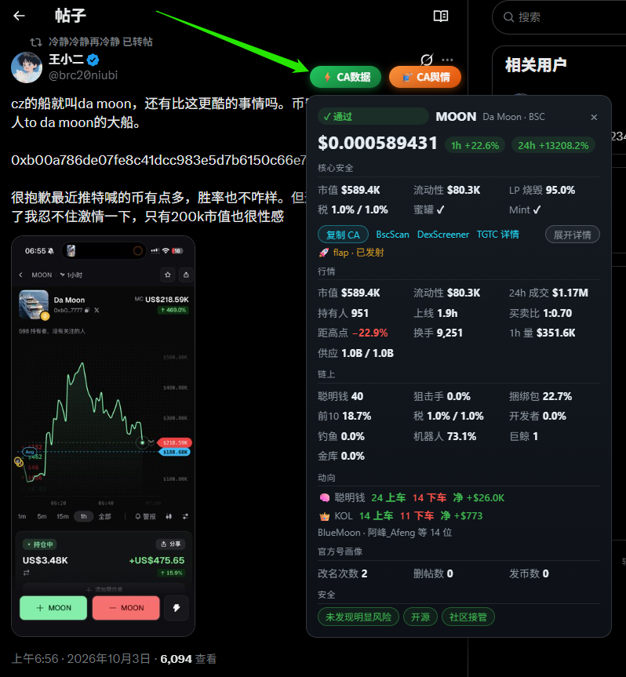
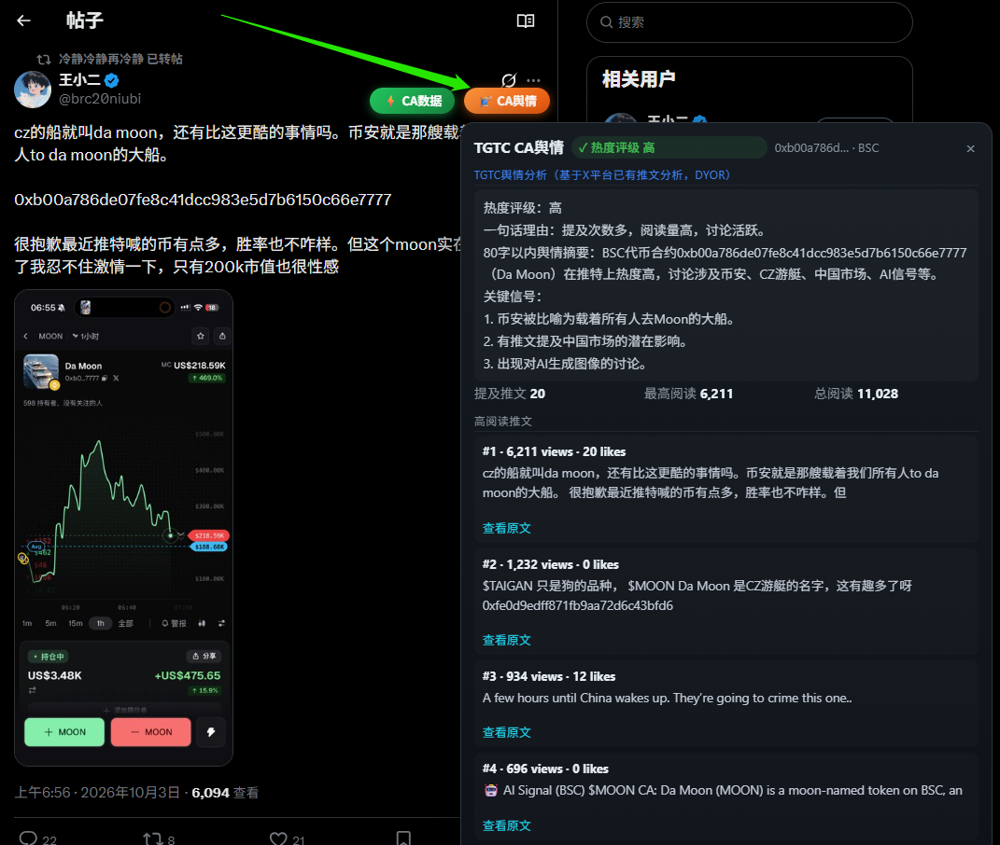

  

# ⚡ TGTC — BSC Token Lookup

**One-click on-chain evaluation + X sentiment scan for BSC tokens, right in your X (Twitter) feed.**

Scan tweets for BSC contract addresses (CA), drop a **⚡ CA Data** badge and a **🧵 Sentiment**
button on each match, and open a full on-chain assessment card or an X sentiment card with a
single click — no page switches, no copy-paste.

[中文说明 ↓](#中文说明)

---

## ✨ Features

### ⚡ On-chain assessment (CA Data)

- **Auto-detects BSC addresses** in tweets (`0x` + 40 hex chars); a tweet with several CAs gets
  **◀ n/N ▶** switching to evaluate each one (same CA within the 10s cache is **not re-billed**).
- **Four-state safety rating — no data ≠ safe**: when fewer than 2 of the key security fields
  (honeypot / mint / LP burn / taxes) are known, the card shows grey **◇ Unknown** instead of any
  pass verdict. Otherwise: `honeypot=true` → red **✗ Honeypot**; no risks → green **✓ Pass**;
  else amber **⚠ Caution** with itemized risk tags.
- **Full assessment card**:
  - Price + **1h / 24h change** · **launchpad progress** (presale % / live)
  - Market: market cap · liquidity · 24h volume · holders · age · buy:sell ratio · distance from ATH · swaps · 1h volume · supply
  - On-chain: smart money · snipers · bundlers · top-10 · taxes · dev holdings · phishing · bots · whales · vault
  - **Smart-money & KOL moves**: wallets in / out + net buy volume (+ KOL names)
  - **Official-account deep profile**: username renames / deleted tweets / tokens created —
    history not visible on the profile page itself
- **⚠️ Copycat warning**: tweet's `$TICKER` vs the on-chain symbol — mismatch gets a banner
  (BSC has heavy copycat forks).

### 🧵 X sentiment scan (CA舆情)

- One click searches X mentions of the CA, ranks them by views, and builds a sentiment card:
  - **Data-driven heat rating** (🔴高 / 🟡中 / ⚪低) — decided by thresholds on mention count +
    views (10+ mentions & 15K+ total views, or a 5K+ top view → 高; 5+/5K+/1.5K+ → 中), **not by AI guesswork**
  - **AI summary** + key signals, based only on the searched tweets
  - **Top tweets** with clean text (CA and links stripped) plus a **View original** link to each X post
- Clear error messages: missing key / not a token / out of credits are told apart.
- **Billed separately** (10 credits per scan; 10-minute cache hits are free).

### General

- **Key saved once**, change anytime in the popup; daily **scanned / flagged** stats shown there.
- **Bilingual** — Chinese for zh browsers, English otherwise; links follow the language.
- Dark theme that matches X's look.

## 📸 Screenshots

## 🚀 Install (load unpacked)

1. Download / clone this repo, or download the ZIP and extract.
2. Open `chrome://extensions` in Chrome.
3. Toggle **Developer mode** (top-right).
4. Click **Load unpacked** → select the folder containing `manifest.json`.
5. Pin the extension from the puzzle icon.

## 🧭 Usage

1. Click the TGTC icon in the toolbar → paste your **API Key** (saved automatically).
2. Get a key: DM [@TG_TC_BOT](https://t.me/TG_TC_BOT) on Telegram → "我的 API" → it's the same
   key you use for the [TGTC Data API](https://www.tgtcbot.com/doc.zh.html). New users get
   **500 free credits** on signup.
3. Browse X — tweets with a BSC contract show **⚡ CA数据** (green) and **🧵 CA舆情** (orange).
4. Click **⚡ CA数据** → the on-chain assessment card pops up right there.
5. Click **🧵 CA舆情** → the X sentiment card (heat rating + AI summary + top tweets).

## 🔌 How it works

The extension is a thin client: it sends the contract address to the
[TGTC aggregation API](https://www.tgtcbot.com/doc.zh.html) (`POST /api/v1/aggregation/token`)
with your key and renders the returned on-chain data; the sentiment card uses
`POST /api/v1/twitter/sentiment`. All data is aggregated and served by **tgtcbot.com** — the
extension itself stores no data, only your key (in `chrome.storage.local`).

Each call consumes credits from your TGTC balance: one aggregate assessment = **4 credits**
(10s cache hits are free), one sentiment scan = **10 credits** (10min cache hits are free).
See [pricing](https://www.tgtcbot.com/pricing.zh.html) for details.

## 🗂 Structure

| File | Role |
|---|---|
| `manifest.json` | MV3 manifest (storage + host permissions for tgtcbot.com) |
| `background.js` | Service worker — the only place cross-origin fetches happen (MV3 CORS) |
| `content-x.js` | X page script: CA detection, badges, assessment & sentiment cards |
| `content-x.css` | Badge + card styles |
| `popup.html` / `popup.js` | API Key settings popup |

## 📝 Changelog

Full update history → **[CHANGELOG.md](CHANGELOG.md)** (v1.6.x: CA sentiment scan — data-driven
heat rating, AI summary, top tweets with original links, URL-safe truncation, error
classification, official-site link · v1.5.x: unknown-tier safety, multi-CA switch, copycat
warning, quick card, official-account deep profile, popup redesign, Check CA badge · v1.4.x:
i18n + icons).

---

## ⚠️ Disclaimer

This extension displays aggregated on-chain data only. It is **not** financial advice. Crypto
assets are highly volatile — evaluate risks yourself.

## 📄 License

MIT — see [LICENSE](LICENSE). This is the official client of the TGTC service; data is
provided by tgtcbot.com.

---

## 中文说明

**TGTC — BSC Token Lookup** 是一个浏览器扩展：打开 X（Twitter）刷推文，带 BSC 合约地址的推文
右上角会出现 **⚡ CA数据** 和 **🧵 CA舆情** 两个按钮，点击即可原地弹出链上评估卡或 X 舆情卡——
无需离开页面。

### 主要功能

**⚡ 链上评估（CA数据）**
- 自动识别推文中的 BSC 合约地址；一条推文多个 CA 支持 ◀ n/N ▶ 切换（同 CA 10 秒缓存内不重复扣次）
- **四态安全评级（没数据 ≠ 安全）**：4 个关键安全字段（蜜罐 / Mint / LP 烧毁 / 税率）已知不足 2 项 → 灰色「◇ 未知」；
  否则蜜罐 → 红「✗」、无风险 → 绿「✓」、其余 → 黄「⚠」并逐条列出风险标签
- 完整评估卡：价格 + 1h/24h 涨跌 · 发射台进度 · 行情（市值/流动性/24h量/持有人/币龄/买卖比/距高点/换手/1h量/供应）
  · 链上（聪明钱/狙击/捆绑/前10/税/开发者/钓鱼/机器人/巨鲸/金库）· 聪明钱/KOL 动向（上下车钱包数 + 净额）
  · 官方号深层画像（改名/删帖/发币历史，页面本身看不到）
- **同名防错**：推文 $TICKER 与链上 symbol 不一致 → 顶部黄色警示（BSC 仿盘多）

**🧵 X 舆情扫描（CA舆情）**
- 一键搜索该 CA 的 X 提及推文 → 按阅读量排序 → 生成舆情卡：
  - **热度评级由数据阈值硬判定**（提及 ≥10 且总阅读 ≥15K 或单条 ≥5K → 高；≥5/≥5K/≥1.5K → 中；其余低），AI 无权改级
  - **AI 摘要 + 关键信号**（只基于搜索到的推文）
  - **高阅读推文**：正文净化（去 CA、去链接）+ 每条底部「查看原文」直达 X 原帖
- 失败原因分类提示：没填 Key / 非代币 / 次数不足，一眼分清
- **独立计费**：每次 10 次，10 分钟缓存命中不扣次

**其他**
- Key 只存本地、随时可改；弹窗显示今日扫描/命中危险统计
- 中英双语（中文环境自动中文，其余英文）；暗色主题适配 X

### 安装

1. 下载本仓库（或 ZIP 解压）
2. Chrome 打开 `chrome://extensions` → 右上角开启**开发者模式**
3. 点**加载已解压的扩展程序** → 选择含 `manifest.json` 的文件夹
4. 工具栏拼图图标里固定 TGTC

### 使用

1. 点工具栏 TGTC 图标 → 粘贴 **API Key**（自动保存）
2. 获取 Key：Telegram 私聊 [@TG_TC_BOT](https://t.me/TG_TC_BOT) →「我的 API」；新用户注册赠送 **500 次**
3. 刷 X —— 带 BSC 合约的推文出现绿色 **⚡ CA数据** 与橙色 **🧵 CA舆情**
4. 点 **⚡ CA数据** → 链上评估卡弹出；点 **🧵 CA舆情** → X 舆情卡弹出

### 数据与计费

扩展是轻客户端：把合约地址 + 你的 Key 发给 [TGTC 聚合接口](https://www.tgtcbot.com/doc.zh.html)
（舆情卡走 `POST /api/v1/twitter/sentiment`），渲染返回的数据。所有数据由 **tgtcbot.com** 聚合提供，
扩展本身不存任何数据（Key 仅存本地）。每次调用消耗账户次数：链上评估 **4 次/次**（10 秒缓存命中免费）、
舆情扫描 **10 次/次**（10 分钟缓存命中免费），详见[定价页](https://www.tgtcbot.com/pricing.zh.html)。

### 更新记录

全部版本历史 → **[CHANGELOG.md](CHANGELOG.md)**（v1.6.x：CA 舆情扫描——数据阈值热度评级、AI 摘要、
高阅读推文原文链接、网址截断保护、错误提示分类、官网链接 · v1.5.x：未知态评级、多 CA 切换、同名防错、
轻卡视图、官方号深层画像、弹窗卡片化、查CA 徽章 · v1.4.x：中英双语 + 图标）。

### 免责声明

仅展示聚合链上数据，**不构成投资建议**。加密资产价格波动剧烈，请自行评估风险。
